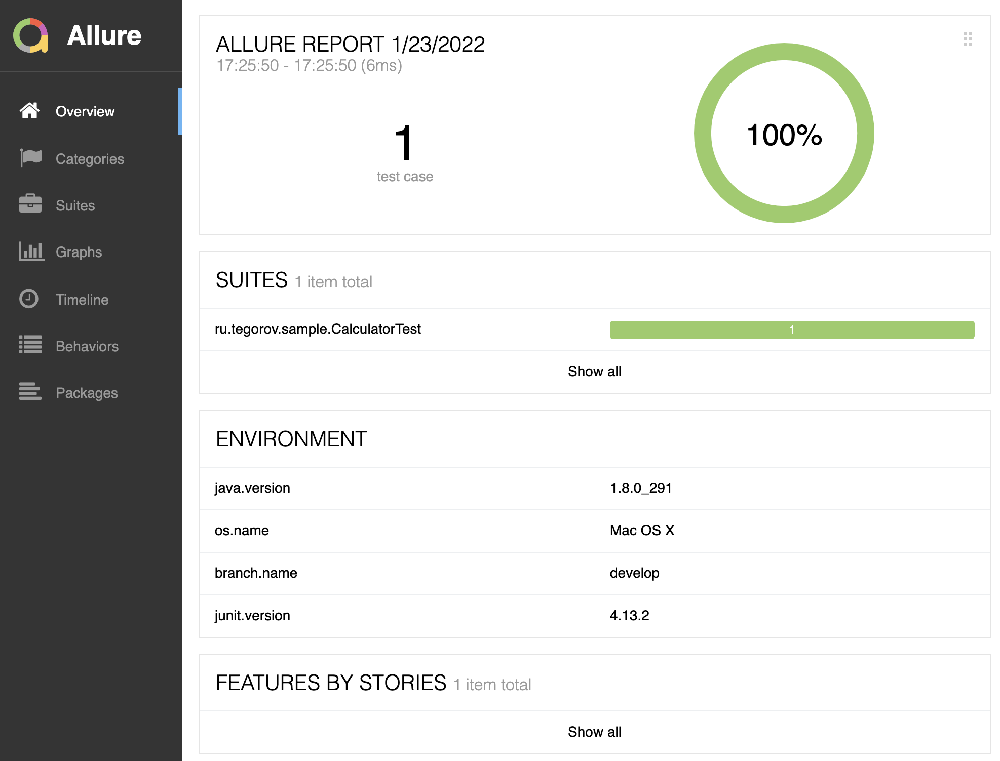

# Allure Environment Maven Plugin

Maven plugin generating [environment.properties](https://docs.qameta.io/allure/#_environment) for Allure report



# Getting Started

TODO

# Configuration

```xml
...
<configuration>
    <properties>
        <property>
            <name>os.name</name>
            <value>${os.name}</value>
        </property>
        <property>
            <name>java.version</name>
            <value>${java.version}</value>
        </property>
        <property>
            <name>junit.version</name>
            <value>${junit.version}</value>
        </property>
        <property>
            <name>branch.name</name>
            <value>${branch.name}</value>
        </property>
    </properties>
</configuration>
...
```

```shell
mvn clean test -Dbranch.name=develop
```

TODO
